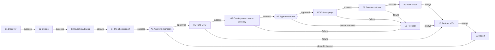

# AAP + MTV standard-path migration (VMware → OpenShift Virtualization)

Ansible Automation Platform drives Migration Toolkit for Virtualization (MTV) for
Windows and RHEL VMs on the **standard path**: no NetApp Shift and no array copy
offload. Every stage records pre-check or post-check evidence, and the workflow has
two approval gates.

What it covers:

- **Discover and decide**: vCenter facts (firmware, Secure Boot, vTPM, CBT, snapshots, disks, NICs), then warm or cold per VM, plan grouping and blockers.
- **Windows**: latest VirtIO drivers staged before migration and proven after, BitLocker escrow, suspend and re-seal to a new persistent vTPM, Secure Boot kept, complete VMware Tools, service, driver and ghost-device removal, IP/DNS/domain checks.
- **RHEL**: VirtIO in the initramfs, NIC naming, fstab, LUKS/Clevis, SELinux, Secure Boot, open-vm-tools removal, qemu-guest-agent.
- **Warm and cold**: warm precopies start before the cutover approval; cutover is set when it is approved.
- **MTV tuning**: saved before, restored exactly after, on every path.
- **Evidence**: one ConfigMap per run, stage and VM, plus an HTML and JSON report.

## Workflow sequence

| Node | Job template | Playbook | What it does | Evidence stage |
|---|---|---|---|---|
| 01 | MTV \| 01 Discover | `playbooks/01_discover.yml` | Reads each VM from vCenter | `discover` |
| 02 | MTV \| 02 Decide | `playbooks/02_decide.yml` | Warm/cold, plan group, blockers; prints the decision table | `decide` |
| 03 | MTV \| 03 Guest readiness | `playbooks/03_readiness.yml` | Windows and Linux pre-checks, VirtIO staging, BitLocker escrow | `readiness` |
| 04 | MTV \| 04 Pre-check report | `playbooks/04_precheck_report.yml` | Go / no-go list, **pre-check report** | report `pre` |
| **A1** | **Approval: go / no-go** | | A person reads the pre-check report | |
| 05 | MTV \| 05 Tune MTV | `playbooks/05_tune_mtv.yml` | Saves and applies `max_vm_inflight`, `precopy_interval` | `tune` |
| 06 | MTV \| 06 Create plans | `playbooks/06_create_plans.yml` | StorageMap, NetworkMap, Plans; **starts warm precopies** | `plan` |
| **A2** | **Approval: cutover window** | | Approve inside the change window | |
| 07 | MTV \| 07 Cutover prep | `playbooks/07_cutover_prep.yml` | BitLocker suspend, stop services, bind Linux NICs to MAC | `cutover_prep` |
| 08 | MTV \| 08 Execute cutover | `playbooks/08_execute_cutover.yml` | Warm: cutover now. Cold: graceful shutdown + start. Waits | `migrate` |
| 09 | MTV \| 09 Post-check | `playbooks/09_postcheck.yml` | Secure Boot/vTPM/EFI on the VM, then prove, clean, re-seal each guest | `target`, `postcheck` |
| 10 | MTV \| 10 Restore MTV | `playbooks/10_restore_mtv.yml` | Restores the exact original MTV values | `restore` |
| 11 | MTV \| 11 Report | `playbooks/11_report.yml` | Final evidence report | report `final` |
| 90 | MTV \| 90 Rollback | `playbooks/90_rollback.yml` | Cancels unfinished VMs, halts targets, powers sources on, resumes BitLocker | `rollback` |



Nodes with several parents (10 and 11) never get two parents firing in the same
run, because the paths into them are mutually exclusive. Leave **"All parents must
converge" off** on those nodes: with it on, a parent that did not run would stop
them from running.

## Where the approvals go in AAP

**Approval 1, go / no-go: after node 04, before node 05.** At that point Discover,
Decide and readiness have run, the decision table is in the node 02 log, and the
pre-check report is stored. Nothing on VMware or OpenShift has changed yet apart from
staging VirtIO drivers and escrowing BitLocker keys. Approved → tune MTV. Denied or
timed out → final report only.

**Approval 2, cutover window: after node 06, before node 07.** Plans are Ready and
warm precopies are already copying data while the VMs keep running, so the approver
can wait for the change window. Approved → suspend BitLocker, stop services and cut
over. Denied or timed out → rollback (cancel precopies) and restore MTV.

**Optional approval 3, accept migration: after node 11.** Use it as a sign-off
before a separate job that deletes the source VMs or removes them from inventory.

### In the AAP UI (2.5)

1. Automation Execution → Templates → open **MTV | Standard migration with approvals** → **Visualizer**.
2. Hover node **04 Pre-check report**, click **+**, choose run type **On success**.
3. Set **Node type** to **Approval**, name it, add a description that tells the approver what to read, and set a **Timeout** (for example 24 h; 0 means wait forever). Save.
4. From the approval node, add **05 Tune MTV** on success and **11 Report** on failure. Denied and timed-out approvals take the failure path.
5. Repeat after **06 Create plans** for the cutover approval (success → 07, failure → 90).
6. Grant the approver team the **Approve** role on the workflow job template (Access/User roles on the template, or organization-wide). Approvers do not need execute rights.
7. Optional: add a notification template to the workflow's **Approval** notifications, so Slack, email or a webhook fires when an approval is waiting, approved, denied or timed out.

Pending approvals appear under the bell icon and under **Workflow Approvals**. They
can also be approved from a change system through the API:
`POST /api/controller/v2/workflow_approvals/<id>/approve/` (or `/deny/`).

### As code

`aap/controller_config.yml` defines the credential types, credentials, project,
inventory source, all twelve job templates, the workflow with both approval nodes,
the survey, and the approver role. Load it with:

```bash
ansible-galaxy collection install infra.aap_configuration ansible.platform ansible.controller
export AAP_HOSTNAME=https://aap.example.com AAP_USERNAME=admin AAP_PASSWORD=...
ansible-playbook aap/apply.yml -e @aap/controller_config.yml
```

## Evidence and reports

Every stage writes one ConfigMap per VM in namespace `mtv-evidence`:

```
mtv-ev-<run>-<stage>-<vm>     labels: mtv.demo/run-id, mtv.demo/stage, mtv.demo/vm, mtv.demo/result=pass|warn|fail
mtv-run-<run>-decisions       decision table and plan grouping
mtv-report-<run>-pre          pre-check report (report.html, report.json)
mtv-report-<run>-final        final evidence report
```

```bash
oc get cm -n mtv-evidence -l mtv.demo/run-id=<run>,mtv.demo/result=fail
oc extract cm/mtv-report-<run>-final -n mtv-evidence --keys=report.html --to=.
```

The run id is AAP's workflow job id, so every node of one workflow run shares it.
Each job log also prints a `[PASS]/[WARN]/[FAIL]` summary per VM and stage, and the
report node publishes counts as workflow artifacts (`mtv_report`).

Any node can be re-run on its own with `-e run_id=<id>`, because each stage reads
its input back from OpenShift rather than from the previous job.

## Prerequisites

- **AAP 2.5** with an execution environment built from `execution-environment.yml` (`kubernetes.core`, `community.vmware`, `vmware.vmware`, `ansible.windows`, plus `kubernetes`, `pyvmomi`, `pywinrm`).
- **MTV 2.12** on OpenShift 4.20 or later, with a vSphere Provider (VDDK image configured) and the `host` destination Provider.
- **network_mappings** for every source port group. Unmapped networks block the VM in Decide. For preserved IPs, map to a Multus bridge or localnet NAD on the same VLAN, not the pod network.
- **Persistent vTPM and EFI** need `vmStateStorageClass` set on the HyperConverged CR.
- **Guest access**: WinRM over HTTPS to Windows, SSH with sudo to Linux, on the same IPs before and after migration.
- **virtio_win_iso_url**: an internal URL serving the current Red Hat `virtio-win` ISO (from the `virtio-win` RPM).
- **BitLocker escrow** to AD DS or Entra ID, or set `bitlocker_escrow_method: none` and `bitlocker_escrow_confirmed: true` if keys are escrowed elsewhere.
- **AAP service account** in OpenShift with rights on Plans, Migrations, maps and ForkliftController in `openshift-mtv`, VirtualMachines in the target namespace, and ConfigMaps in `mtv-evidence`.
- **vCenter account** with read access and power operations on the source VMs.

## Main variables

All defaults live in `roles/mtv_common/defaults/main.yml`. The ones to set first:

| Variable | Purpose |
|---|---|
| `migration_vms` | Survey: vCenter VM names |
| `migration_mode` | Survey: `auto`, `warm` or `cold` |
| `vcenter_datacenter` | Datacenter holding the VMs |
| `mtv_source_provider` | Name of the vSphere Provider CR |
| `mtv_target_namespace`, `mtv_target_storage_class` | Where the VMs land |
| `network_mappings` | Source port group → `multus` NAD or `pod` |
| `warm_min_disk_gb`, `large_disk_gb`, `max_vms_per_plan` | Decision thresholds |
| `mtv_tuning` | Temporary ForkliftController values |
| `virtio_win_iso_url` | VirtIO ISO for staging and post-migration updates |
| `bitlocker_escrow_method` | `ad`, `aad` or `none` |
| `win_remnant_exclude` | Regex of VMware products to keep (for example Horizon) |
| `linux_rebind_clevis` | Re-bind Clevis TPM2 after migration (needs the LUKS credential) |

Inventory: copy `inventory/hosts.example.yml` to `inventory/hosts.yml`. Hostnames
should match vCenter VM names, or set `mtv_vm_name` per host.

## Confirm on your build before production

- Field names in Plan and Migration (`preserveStaticIPs`, `targetPowerState`, `cutover`, `cancel`) on your exact MTV build. Unknown fields are pruned silently by the API server, so check the created objects once.
- The `vmID` label on VMs created by MTV, used to find the target VM.
- Secure Boot and persistent EFI behaviour on your OpenShift Virtualization version.
- `pnputil /remove-device` exists only on Windows build 19041 and later; older builds get a manual-action note instead.
- TPM+PIN and startup-key BitLocker protectors are reported for manual re-creation, never removed automatically.

## Tests

```bash
python3 tests/test_filters.py        # decision logic and parsers
ansible-lint                         # profile: production
ansible-playbook --syntax-check playbooks/*.yml -i inventory/hosts.example.yml
```
